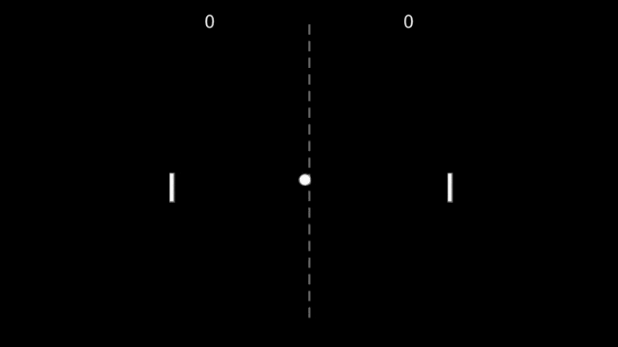

# Pong game with arduino
## Características del juego

- Rebotes 
    - Con los 2 jugadores 
    - Con la parte superior e inferior de la pantalla
- Marcador que nos indicará los puntos de cada jugador
    - Victoria a los 3 puntos, además de una pantalla final que nos permite volver a jugar
- Tres tipos de sonidos:
    - Al rebotar
    - Al conseguir puntos
    - Al ganar
- El movimiento inicial será aleatorio
- Aumento de velocidad en el eje X cada vez que un jugador golpe la bola
- Movimiento con un sensor de distancia (Sharp GP2D12)

## Decisiones
###### Movimiento Inicial
- En el eje X tendrá un incremento de 1,2 o 3 para cualquiera de los lados
- En el eje Y tendrá un incremente de 1,2,3,4,5 o 6 para arriba o para abajo
- Cada vez que se marca un punto se recalcula aleatoriamente estos incrementos

###### Distancia del sensor para mover al jugador 1
- Si la distancia es mayor a unos 30 cm el jugador permanecerá quieto
- Si la distancia está entre 15 y 30 cm se moverá hacia arriba
- Si la distancia es menor de unos 15 cm se moverá hacia abajo

###### Jugadores
- Ambos jugadores estarán a una distancia de 50 unidades con respecto a su lado más cercano en el eje X. Con respecto al eje Y estarán centrados
- Los jugadores nunca podrán salir de la pantalla
- Solo se comprueba si la bola ha golpeado un jugador según el último jugador que golpeara la bola. Esto se hace para evitar alguna colisión extraña en la que la bola cambia muchas veces de sentido cuando la golpeamos.

###### Bola
- La bola se inicial a mover en el centro de la pantalla, moviendose en una dirección aleatoria
- La bola irá aumentando la velocidad en el eje X, esto hace que la partida se vuelva más difícil cada cierto tiempo. Este incremento se producirá cuando un jugador golpea una bola
- La bola tendrá rebotes con el la parte superior, inferior y ambos jugadores. Si por el contrario choca con alguno de los lados, esto dará un punto al jugador contrario al lado

###### Colisión Bola con jugador
1. Calculamos el lado más cercano a la bola
2. Calculamos la distancia entre ese lado y el centro de la bola
3. Si la distancia es menor al radio significa que existe colisión
4. Calculamos la siguiente dirección de la bola según diferentes condiciones:
    - Si el centro de la bola se encuentra por encima del 20% de la superficie del jugador la bola irá para arriba
    - Si el centro se encuentra por debajo del 20% de la superficie del jugador la bola irá para abajo
    - Si el centro se encuentra en el centro la bola solo se moverá horizontalmente

###### Input
- Utilizamos la mano para mover hacia arriba al jugador 1 
- Utilizamos la mano para mover hacia abajo al jugador 1
- Utilizamos ↑ para mover hacia arriba al jugador 2
- Utilizamos ↓ para mover hacia abajo al jugador 2
- Utilizamos Enter para resetear la partida cuando un jugador ha ganado

###### Otras decisiones
- Linea que nos indica el centro del campo
- Tamaño de jugador de 5x40
- Cada partida es a 3 puntos
- Tamaño del juego de 500 x 500
- Se requiere de tener en la misma carpeta los distintos sonidos y el ejecutable

## Resultado final
A continuación se ve un ejemplo del juego:

## Sonidos utilizados
- [Rebote](https://www.youtube.com/watch?v=o8YIN11w0wA&ab_channel=Sonidos%26EfectosHD)
- [Al marcar](https://www.youtube.com/watch?v=y9rRD5yZqjE&list=PLuE1RIpYgk-UmLN1jS4Y9AZr_0FjujtfK&index=17&ab_channel=GFXSounds)
- [Victoria](https://www.youtube.com/watch?v=xP1b_uRx5x4&ab_channel=DragRacingMarinaDangs7)

## Herramientas utilizadas
- [Descargar sonidos](https://yt1s.com/)
- [Processing](https://processing.org/)
- [Arduino](https://www.arduino.cc/)
- [Cortar sonidos](https://mp3cut.net/es/)
- [Editar el readme.md](https://dillinger.io/)

Realizado por [José Juan Reyes Cabrera](https://github.com/JoseJuanRC)
Realizado por [Samuel Arrocha Quevedo](https://github.com/Samuel-AQ)
Realizado por [Anayara Moreno Merino](https://github.com/ana3311)
